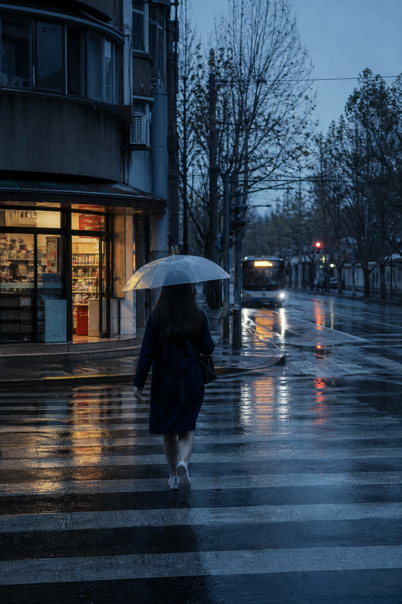

# Scene Score v0.2.0 draft

**为场景记谱，让一张照片本来的节奏变得可见。**  
**Score the scene. Make its rhythm visible.**

[中文说明](#中文说明) · [English](#english) · [案例](#案例) · [项目标签](#项目标签)

## 中文说明

Scene Score 会把照片里的重复、方向、留白和色彩关系，变成一张有节奏的当代艺术图像。它不是滤镜：人物、树、道路、船或建筑仍然来自你的照片，图形只把场景本来就有的关系放大出来。

### 一句话安装

把下面这段直接发给你的 Codex 或 Agent：

```text
请帮我安装 Scene Score：从 https://github.com/truman-t3/scene-score-skills 下载最新版本，安装到我的 Codex Skills 目录，文件夹命名为 scene-score。不要覆盖我已有的 Skills；如果已经有 scene-score，先告诉我当前版本，除非我确认，否则不要覆盖。完成后确认我可以用 $scene-score 调用它。
```

如果 Agent 无法代装：下载仓库 ZIP，解压后把整个文件夹复制到 `C:\Users\你的用户名\.codex\skills\scene-score\`，然后重启 Codex。

### 怎么用

上传一张照片，然后说：

```text
请用 $scene-score 把这张照片变成场景乐谱。保留主体，让画面有清晰但不过度的艺术化变化。
```

不需要先理解“拍点”或“延音”。你只需补充希望保留的对象、情绪，或想要更强/更克制的效果。

### 你会得到什么

- 保留这张照片独有的人、物或地点。
- 把道路、台阶、树叶、水波、光线等关系变成可见的视觉节奏。
- 得到一张能独立成立、而不是套同一版式的艺术图像。

## 案例

### 雨街：原图 → 场景乐谱

斑马线成为拍点，通向公交车的路线成为延音，雨雾留下停顿，店铺暖光成为一次重音。

| 原图 | 场景乐谱 |
| --- | --- |
|  |  |

同一方法还在两类不同场景中验证：

- **阶梯大厅：**台阶重复成为上行节奏，栏杆延续为方向。
- **雾湖银杏：**叶片和芦苇密度成为拍点，船迹与地平线延展为水面方向。

完整案例文件在 [`examples/`](examples/) 中；每次版本调整都用 [三场景评测](evals/scene-score-evals.md) 复查。

### 示例素材

仓库中的示例图与封面均为 Scene Score 项目制作的演示素材，不含第三方照片；它们随本仓库的 MIT 许可提供。使用你自己的照片时，请先确认你拥有相应的使用权限。

The example images and cover are Scene Score demonstration assets, with no third-party photographs included. They are provided under this repository's MIT license. Make sure you have permission before using your own photos.

## 项目标签

`codex-skill` · `image-generation` · `photo-to-art` · `generative-art` · `visual-rhythm` · `creative-tools` · `photography`

## 当前状态

当前公开稳定版为 [v0.2.0](https://github.com/truman-t3/scene-score-skills/releases/tag/v0.2.0)。它增加自然景观案例、三场景评测与更安全的 Agent 安装提示词。

想查看方法规则、评测或更新记录： [Skill 指令](SKILL.md) · [转译规则](references/translation-grammar.md) · [评测集](evals/scene-score-evals.md) · [v0.2 复测记录](evals/v0.2-validation.md) · [更新记录](CHANGELOG.md)

---

## English

Scene Score turns the repetitions, directions, quiet space, and colour relationships in a photograph into a contemporary art image. It is not a filter: the people, places, and objects remain specific to your photo while graphics reveal its existing rhythm.

### Ask your agent to install it

```text
Please install Scene Score from https://github.com/truman-t3/scene-score-skills into my Codex Skills directory as scene-score. Keep my existing skills untouched. If scene-score already exists, report its current version and do not overwrite it unless I confirm. Then confirm that I can call it with $scene-score.
```

### Use it

Upload a photo, then write:

```text
Use $scene-score to turn this photo into a Scene Score. Keep the subject and create a clear, restrained artistic transformation.
```

### What it does

- Retains the people, objects, and places that make a photograph specific.
- Turns routes, steps, leaves, waves, light, and quiet space into visible rhythm.
- Creates an original art image rather than applying a fixed poster layout.

See the [examples](examples/) and the three-scene [evaluation set](evals/scene-score-evals.md).

### Project tags

`codex-skill` · `image-generation` · `photo-to-art` · `generative-art` · `visual-rhythm` · `creative-tools` · `photography`

The public stable release is [v0.2.0](https://github.com/truman-t3/scene-score-skills/releases/tag/v0.2.0), adding a natural-field case, three scene checks, and a safer agent install prompt.

For the full method and evaluation set: [Skill instructions](SKILL.md) · [Translation grammar](references/translation-grammar.md) · [Evaluation set](evals/scene-score-evals.md) · [v0.2 run notes](evals/v0.2-validation.md) · [Changelog](CHANGELOG.md)
