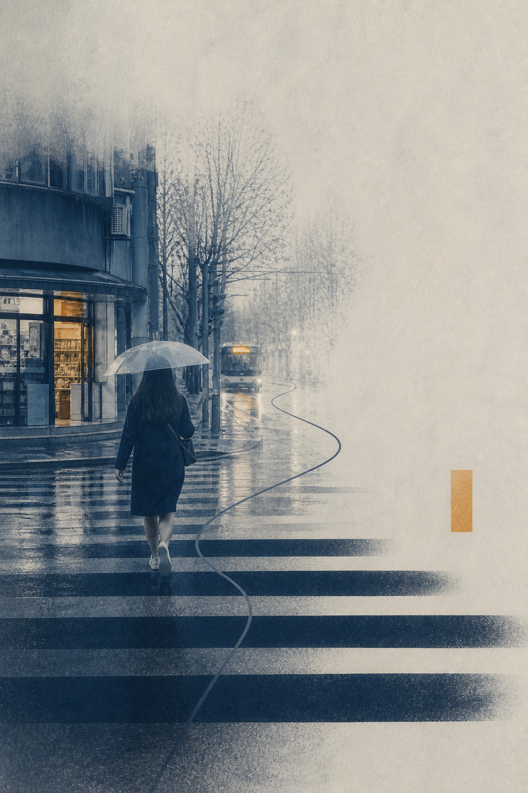
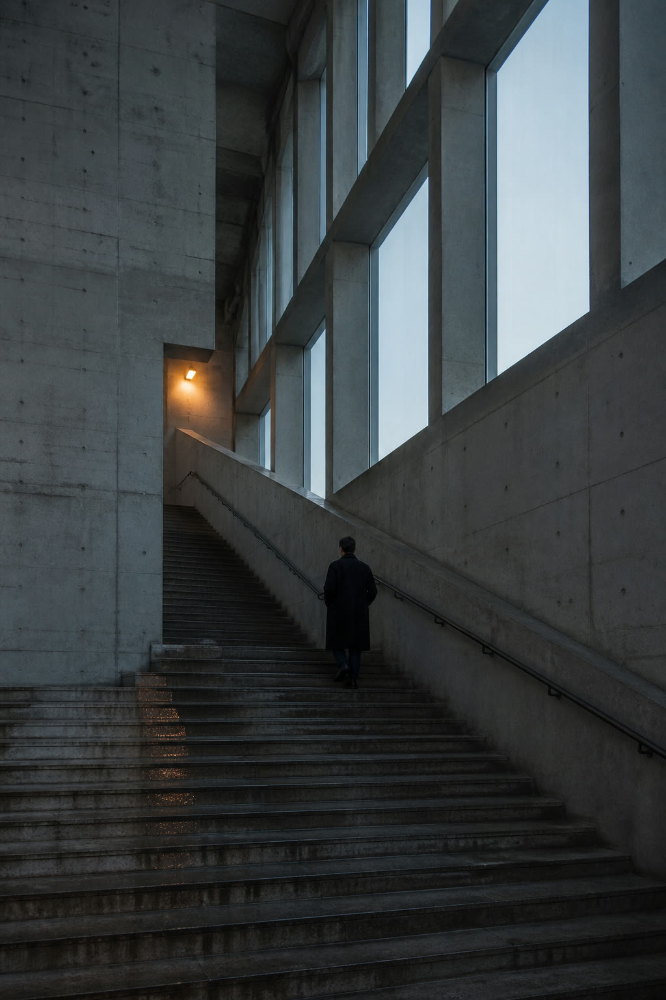
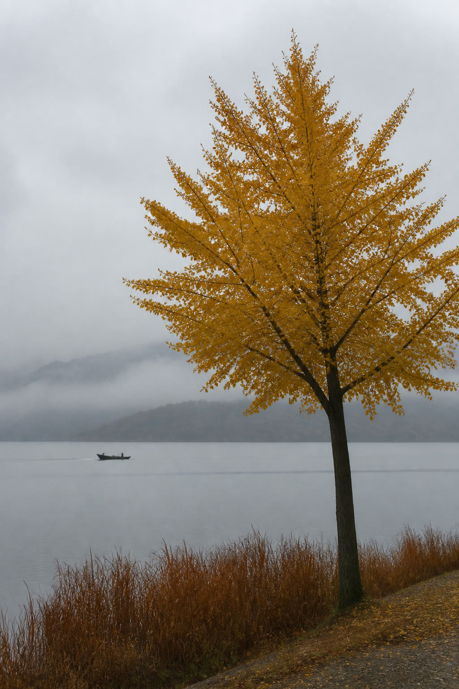
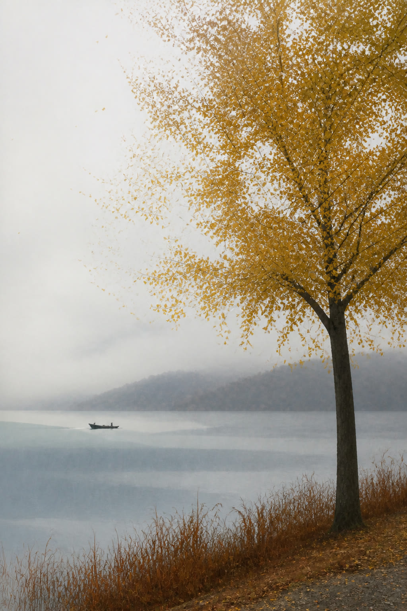
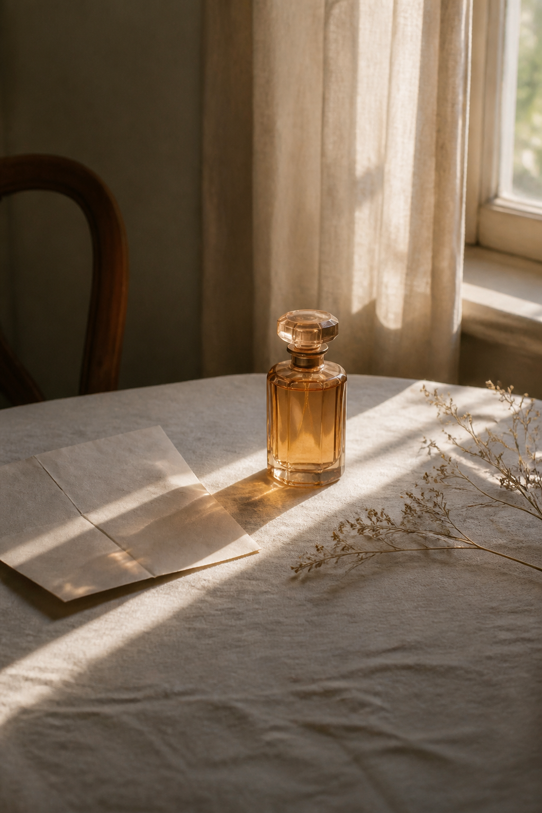

# Scene Score

**为场景记谱，让一张照片本来的节奏变得可见。**  
**Score the scene. Make its rhythm visible.**

[中文说明](#中文说明) · [English](#english) · [案例](#案例) · [项目标签](#项目标签)

## 中文说明

Scene Score 会把照片里的重复、方向、留白和色彩关系，变成一张有节奏的当代艺术图像。它不是滤镜：人物、树、道路、船或建筑仍然来自你的照片，图形只把场景本来就有的关系放大出来。

### 一句话安装

把下面这段直接发给你的 Codex 或 Agent：

```text
请帮我安装 Scene Score：从 https://github.com/truman-t3/scene-score-skills 下载最新版本，安装到我的 Codex Skills 目录，文件夹命名为 scene-score。不要覆盖我已有的 Skills；如果已经有 scene-score，先告诉我当前版本，除非我确认，否则不要覆盖。完成后确认我可以用 $scene-score 调用它。
```

如果 Agent 无法代装：下载仓库 ZIP，解压后把整个文件夹复制到 `C:\Users\你的用户名\.codex\skills\scene-score\`，然后重启 Codex。

### 怎么用

上传一张照片，然后说：

```text
请用 $scene-score 把这张照片变成场景乐谱。保留主体，让画面有清晰但不过度的艺术化变化。
```

不需要先理解“拍点”或“延音”。你只需补充希望保留的对象、情绪，或想要更强/更克制的效果。

想得到案例中这种更强的留白与提炼效果，可以直接说：

```text
请用 $scene-score 的 Gallery Score 模式处理这张图：保留主体，用大面积来自原图的留白，只保留一个主节拍、一条方向线和一个小重音；画面要像案例一样有明确的提炼与节奏。
```

### 你会得到什么

- 保留这张照片独有的人、物或地点。
- 把道路、台阶、树叶、水波、光线等关系变成可见的视觉节奏。
- 得到一张能独立成立、而不是套同一版式的艺术图像。

## 案例

下面直接展示项目的完整案例，不把成图藏到评测链接里。每张都保留场景来源与不同的记谱方式。

### 雨街：原图 → 路径节奏

斑马线成为拍点，通向公交车的路线成为延音，雨雾留下停顿，店铺暖光成为一次重音。

| 原图 | 场景乐谱 |
| --- | --- |
|  |  |

### 雨街：雾中留白版

不把照片压成滤镜，而是让雾的空白、斑马线的间隔和细线路线共同组织画面。



### 阶梯大厅：上行节拍

真实台阶被放大为向上的不等节拍，栏杆延续为一条贯穿画面的方向线。

| 原图 | 场景乐谱 |
| --- | --- |
|  |  |

### 雾湖银杏：自然密度

叶片和芦苇的聚散成为拍点，雾、水线和小船留下更安静的延音。

| 原图 | 场景乐谱 |
| --- | --- |
|  |  |

### 香水静物：光线谱面

桌面光束、瓶身阴影和枝条方向被整理为轻盈的纵向节奏，说明方法也能用于产品与静物场景。

| 原图 | 场景乐谱 |
| --- | --- |
|  |  |

四条评测仍用于检查方法是否成立，但它们不替代这组公开案例。

完整案例文件在 [`examples/`](examples/) 中；每次版本调整都用 [四场景评测](evals/scene-score-evals.md) 复查。

### 示例素材

仓库中的示例图与封面均由 Scene Score 项目提供用于展示；使用你自己的照片或补充案例前，请先确认你拥有相应的使用权限。

The example images and cover are supplied by the Scene Score project for demonstration. Make sure you have permission before using your own photos or adding new examples.

## 项目标签

`codex-skill` · `image-generation` · `photo-to-art` · `generative-art` · `visual-rhythm` · `creative-tools` · `photography`

## 当前状态

当前公开稳定版为 [v0.2.2](https://github.com/truman-t3/scene-score-skills/releases/tag/v0.2.2)。它恢复完整案例墙，增加 Gallery Score 模式与静物评测，并补齐独立可读的英文说明。

想查看方法规则、评测或更新记录： [Skill 指令](SKILL.md) · [转译规则](references/translation-grammar.md) · [画廊式构图规则](references/gallery-score.md) · [评测集](evals/scene-score-evals.md) · [v0.2.1 复测记录](evals/v0.2.1-validation.md) · [更新记录](CHANGELOG.md)

---

## English

Scene Score turns the repetitions, directions, quiet space, and colour relationships in a photograph into a contemporary art image. It is not a filter: the people, places, and objects remain specific to your photo while graphics reveal its existing rhythm.

### Install with your agent

```text
Please install Scene Score from https://github.com/truman-t3/scene-score-skills into my Codex Skills directory as scene-score. Keep my existing skills untouched. If scene-score already exists, report its current version and do not overwrite it unless I confirm. Then confirm that I can call it with $scene-score.
```

### Install manually

Download this repository as a ZIP, unpack it, and place the contents in:

```text
C:\Users\<your-user>\.codex\skills\scene-score\
```

Then restart Codex. If you already have a `scene-score` folder, make a backup first.

### Use it

Upload a photo, then write:

```text
Use $scene-score to turn this photo into a Scene Score. Keep the subject and create a clear, restrained artistic transformation.
```

For the showcased large-rest, distilled treatment, use Gallery Score mode:

```text
Use $scene-score in Gallery Score mode: retain the subject, reserve a large source-derived quiet field, and use one dominant rhythm, one directional phrase, and at most one accent.
```

### What you get

- A reading of the photo before composing: subject, light, movement, intervals, and usable rest.
- A restrained or expressive path rather than one fixed look.
- A finished image plus a compact score explaining the visual decisions.

### Gallery

The full gallery above is shared by Chinese and English readers. These cases show the intended range: photo-led work with deliberate breathing room and a small number of clear visual beats.

#### Rain street — route rhythm

Zebra crossings become beats, the route to the bus becomes a sustained phrase, rain and haze make the rest, and the shop light becomes an accent.

| Source photo | Scene Score |
| --- | --- |
|  |  |

#### Rain street — fog and rest

Fog, the intervals between crossings, and one fine route line organise the picture without reducing it to a filter.


#### Stair hall — ascending pulse

The physical stairs are rebuilt as uneven upward beats; the handrail continues as one directional line through the picture.

| Source photo | Scene Score |
| --- | --- |
|  |  |

#### Misty ginkgo — natural density

Clusters and gaps of leaves and reeds become beats, while mist, water, and the small boat retain a quieter sustain.

| Source photo | Scene Score |
| --- | --- |
|  |  |

#### Perfume still life — light score

The light beam, bottle shadow, and branch direction form a light vertical rhythm, showing that the method also works for product and still-life photography.

| Source photo | Scene Score |
| --- | --- |
|  |  |

### Evaluation

The four checks—Rain Street, Stair Hall, Misty Ginkgo, and Perfume Still Life—protect subject fidelity and composition hierarchy without promising pixel-identical results. Read the [evaluation set](evals/scene-score-evals.md) and [v0.2.1 validation notes](evals/v0.2.1-validation.md) for their sources, intended outputs, and acceptance criteria.

### Demo assets

The example images and cover artwork are provided by the Scene Score project for display. Before using your own photos or adding examples, make sure you hold the appropriate rights.

### Project tags

`codex-skill` · `image-generation` · `photo-to-art` · `generative-art` · `visual-rhythm` · `creative-tools` · `photography`

### Current release

The current public release is [v0.2.2](https://github.com/truman-t3/scene-score-skills/releases/tag/v0.2.2). It restores the full gallery, adds Gallery Score plus a still-life check, and completes the English README as an independent reading path.

For the full method and evaluation set: [Skill instructions](SKILL.md) · [Translation grammar](references/translation-grammar.md) · [Gallery Score guide](references/gallery-score.md) · [Evaluation set](evals/scene-score-evals.md) · [v0.2.1 run notes](evals/v0.2.1-validation.md) · [Changelog](CHANGELOG.md)
