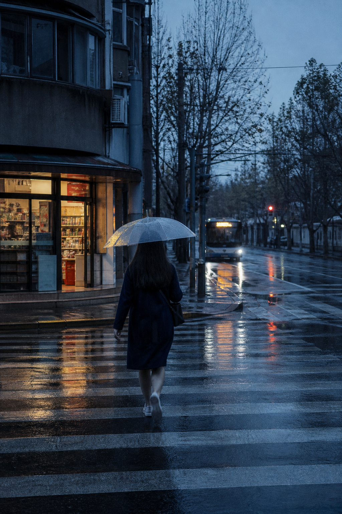
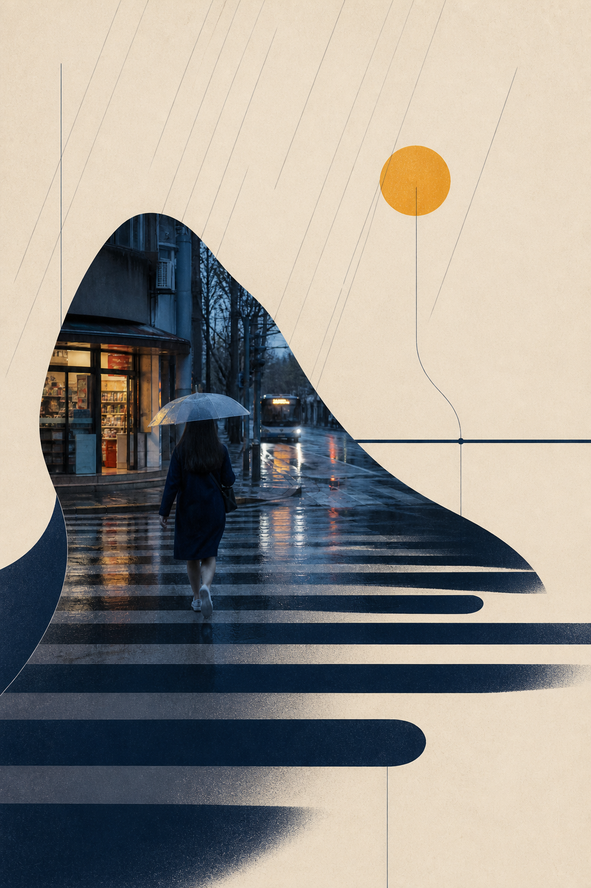

# Scene Score v0.1.0

**Score the scene. Make its rhythm visible.**

[中文说明](README.zh-CN.md) · [Skill instructions](SKILL.md) · [Translation grammar](references/translation-grammar.md)

Scene Score is a Codex skill that turns a photograph's light, movement, interval, density, and quiet space into a source-faithful contemporary art print.

**Current release:** `v0.1.0` — first public release.

It does not apply a fixed visual style. It reads the relationships already present in a scene, then makes those relationships visible as **pulse, phrase, rest, and accent**. The photograph remains evidence; the graphics become its score.

```text
Photograph → read the scene → name its rhythm → re-author the structure → inspect at thumbnail size
```

## What makes a Scene Score

| Principle | What it means |
| --- | --- |
| Keep a factual anchor | One person, object, place, or relationship remains recognisable. |
| Translate, do not decorate | Every major mark comes from an observed force: a crossing, stair, rail, horizon, shadow, wind, wave, or density shift. |
| Let quiet space carry tempo | Fog, wall, sky, water, and darkness are active compositional material, not leftover background. |
| Prove the difference | At least two source-derived structural changes must remain obvious at thumbnail size; colour grading and texture alone fail the test. |

No literal notes or staffs. No stock cream background, circle, stripe, or collage recipe. A mark is only valid when this photograph gives it a reason to exist.

## Two ways to score a photograph

| Mode | Best when | Result |
| --- | --- | --- |
| **Score-led reconstruction** | You want a clear artistic transformation while retaining the scene's identity. | A factual photographic anchor interlocks with two or three source-derived graphic roles. |
| **Amplified score** | You want a stronger, more editorial image. | One observed geometry expands to carry the thumbnail, changing the silhouette or spatial partition of the source. |

## Scene archive

Each pair records not only an outcome but the visual decision that led to it.

### 01 · Rain street

**Keep:** the umbrella walker, shop, bus, and wet crossing.  
**Score:** the crossing interval becomes a pulse; the route to the bus becomes a phrase; rain haze becomes rest; the shop's warmth becomes one amber accent.

| Source photograph | Scene Score |
| --- | --- |
|  |  |

### 02 · Stair hall

**Keep:** the ascending person, staircase, handrail, window bays, and exit light.  
**Score:** the treads become an ascending pulse; the rail continues as a long phrase; the concrete wall becomes rest; the exit light becomes one amber accent.

| Source photograph | Scene Score |
| --- | --- |
|  |  |

## Requirements

- Codex or another compatible Skill runtime.
- Image inspection for source reading and quality review.
- An image-generation capability for the final transformation.

The package contains no scripts, API keys, external fonts, or downloaded runtime assets. The examples are original local test assets created for this repository.

## Install

Clone this repository into the matching skill directory:

```bash
git clone https://github.com/truman-t3/scene-score-skills.git ~/.codex/skills/scene-score
```

On Windows, the equivalent folder is usually `C:\Users\<your-name>\.codex\skills\scene-score\`.

Restart Codex if the skill does not appear immediately.

## Use

Upload a photograph, then write:

```text
Use $scene-score to turn this image into a Scene Score. Keep the main subject,
identify the pulse, phrase, and rest, then create a contemporary art print with
structural changes that remain clear at thumbnail size.
```

For a bolder result, add: `Use amplified score mode. Make the source-derived hero geometry unmistakable.`

## Output

The skill returns:

1. A transformed image.
2. A short note explaining what was kept and what was translated.
3. The final generation prompt when a project-bound output is requested.

## Repository structure

```text
scene-score/
├── SKILL.md
├── README.md
├── README.zh-CN.md
├── LICENSE
├── agents/
│   └── openai.yaml
├── references/
│   └── translation-grammar.md
└── examples/
```

## License

MIT. See [LICENSE](LICENSE).
